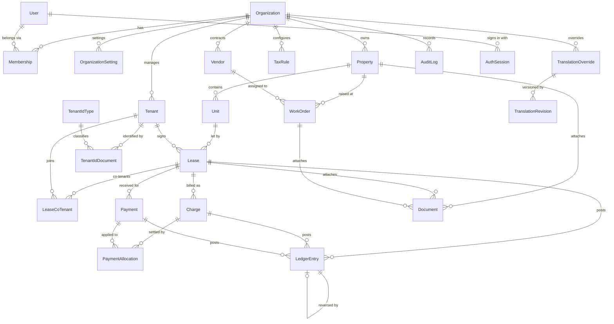

# Architecture

Commercial property management for property owners and landlords in Ethiopia.
One monorepo, three runnable things (web, API, worker), three shared libraries
(calendar, money/domain rules, i18n).

```
apps/
  api/        Express 5 + Prisma REST API (/api/v1) + pg-boss worker
  web/        Next.js 15 App Router UI (separate process, talks REST only)
  mobile/     Expo app — planned, not started (the API is designed for it)
packages/
  calendar/   Ethiopian ↔ Gregorian conversion, period maths, formatting
  shared/     money, domain constants, permissions, Zod schemas, types
  i18n/       translation keys, catalogs, resolution order, CSV, linting
docs/         architecture, decisions, API reference, references, CI
```

## Why this shape

**Business logic lives in `apps/api`, not in the web app.** The web UI calls the
same REST endpoints a mobile app will, so a rule can never be enforced only in one
client. There are no Next.js server actions as a private path to the database.

**Money is an integer.** Every amount is stored as minor units (santim) in a
`BigInt` column with an explicit currency code, computed with `packages/shared`,
and serialised as a decimal **string** over the wire. No float ever touches a
balance.

**Dates are Gregorian instants in the database; calendars are a display concern.**
`DateTime`/`Date` columns hold UTC instants. A lease carries a `billingCalendar`,
which decides how its periods and due dates are generated (the Ethiopian calendar
has 12×30 days plus Pagume, 5 or 6 days). Conversion happens exactly once, at the
boundary, in `packages/calendar`.

**The ledger is append-only.** Charges post positive entries, payments negative,
reversals the exact negation. Nothing is updated or deleted; a mistake is corrected
by a reversing entry, so the history is always auditable and `sum(amountMinor)` for
a lease _is_ its balance.

**Multi-organization from the first migration.** Every table that holds tenant data
carries `organizationId`; every query is scoped by it; a record from another
organization returns 404, never 403 (404 leaks nothing). `apps/api/src/test/isolation.test.ts`
proves it, including writes.

## Domain model



Notes that matter when reading it:

- **`LedgerEntry` is the single source of truth for money.** `Charge` and `Payment`
  are the documents a person recognises; both post to the ledger, and a correction is
  a new row pointing at the one it reverses (`reversesEntryId`). A lease balance is
  `sum(amountMinor)` over its entries.
- **`Charge.leaseId` is nullable** by design: ad-hoc and deposit charges exist without
  a lease period, and a charge always carries the organization for scoping.
- **`Document` is polymorphic** (nullable `propertyId`/`unitId`/`tenantId`/`leaseId`/
  `chargeId`/`workOrderId`) rather than one table per entity — one storage path, one
  checksum, one soft-delete rule.
- **`TranslationOverride.organizationId` is nullable**: a null row is a global
  override, a set row is that organization's wording. That is the "override → catalog
  → English" chain in the database.
- **`TaxRule.verified`** is the flag that keeps unverified Ethiopian tax values from
  ever looking authoritative in the UI.

## Request lifecycle (API)

```
HTTP → helmet → CORS allowlist → JSON body limit
     → requestContext (request id, logger)
     → attachPrincipal (JWT → membership + organization re-read from the DB)
     → route: requirePermission(...) → validate({ body, query, params })
     → service (transaction, audit, ledger)
     → error middleware (AppError taxonomy → stable codes)
```

Access tokens (HS256, `jose`) are short-lived (15 min); refresh tokens are random
256-bit values stored **hashed** in `AuthSession`, rotated on every refresh, and a
reused token revokes the whole family. Roles are `owner_admin`, `manager`,
`accountant`, `maintenance`, `tenant`, resolved against the single permission
matrix in `packages/shared/src/permissions.ts` — the web app uses the same table to
hide actions the user cannot perform.

## Data model (27 tables)

- **Organization** — `Organization`, `OrganizationSetting` (key/value, typed by
  `DEFAULT_ORG_SETTINGS`), `Membership` (user ↔ org + role).
- **Identity** — `User`, `AuthSession`, `TenantIdType` (configurable local ID
  types, global or per organization), `Region`/`City` (seeded reference data).
- **Portfolio** — `Property` (Ethiopian address: region, city/zone, sub-city,
  woreda, kebele, house number, landmark), `Unit`.
- **People** — `Tenant` (with `language`), `TenantIdDocument` (number encrypted with
  AES-256-GCM, last four digits kept in clear for display/search).
- **Leasing** — `Lease` (billing calendar, due day, grace period, late fee,
  deposit, escalation), `LeaseCoTenant`.
- **Money** — `Charge` (`@@unique([leaseId, periodKey, type])` is what makes
  monthly generation idempotent), `Payment`, `PaymentAllocation`, `LedgerEntry`
  (`reversesEntryId`), `TaxRule` (configurable, unverified by default).
- **Operations** — `Vendor`, `WorkOrder`, `Document` (storage-agnostic key +
  checksum, soft-deleted).
- **Platform** — `Notification`, `TranslationOverride` / `TranslationRevision`,
  `AuditLog`, `JobRun` (idempotency key per job run).

## Charge generation and the worker

`apps/api/src/worker.ts` is the **only** place jobs run — never inside a web
request. Queues: `charges.generate` (monthly rent), `charges.overdue-sweep`
(reminders + late fees), `notifications.send`. A run can be triggered once with
`pnpm --filter @pms/api worker -- --once=charges.generate`, which is what a cron
entry should call.

Generation is idempotent at the database level: the insert either succeeds or hits
the unique constraint, which is caught and counted as `skippedExisting`. Two
workers racing, or a manager double-clicking, still produce one charge per lease and
period. A lease that starts mid-period is charged pro-rata (half-up, single
rounding) for that period only.

## Payments

Manual recording (cash, bank transfer, cheque) is first-class and goes through the
same code path as a provider-confirmed payment: one `Payment` row, its allocations,
and a negative `LedgerEntry` in a single `Serializable` transaction with retry on
`P2034`. Allocation is oldest-charge-first; anything left over stays as a credit on
the lease. Provider adapters implement
`initiate / verify / webhook / refund / reconcile`; `mock` is complete, Telebirr and
Chapa throw a `ProviderNotConfiguredError` that names the exact credentials needed
rather than guessing at an undocumented API.

## Internationalisation

Keys are stable identifiers (`lease.status.active`), never English sentences.
Lookup order: **organization override → global override → shipped catalog →
English fallback → the key itself**. Each resolved string reports where it came from
and whether a human reviewed it, so machine drafts are visibly unreviewed. The
Translation Manager (`/settings/translations`) lists every key with English, the
current text and its source; supports filters (untranslated, machine draft,
reviewed, overridden), per-key save with history, and CSV import/export. ICU plural
and argument formatting is verified by linting in CI, which catches a translation
that drops `{amount}` before a tenant ever sees the SMS.

## Web application

Next.js 15 App Router, React 19, Tailwind v4, shadcn-style components, Apache
ECharts. The browser only ever calls **relative** URLs (`/api/v1/...`); the Next
server proxies them to the API (`API_PROXY_TARGET`), so the same build works
locally, in a sandbox preview, and behind a load balancer without a rebuild. The
13-month Ethiopian date picker and the period picker are built on
`packages/calendar`, and the language/calendar switchers override the organization
default for the signed-in user.

## Security

Argon2id password hashing; rate limiting on `/auth/*`; `helmet`; strict CORS
allowlist; Zod validation on every endpoint; uploads restricted by MIME type and
size with a path-traversal-safe storage key; secrets only from the environment with
fail-fast validation at startup; tenant ID numbers encrypted at rest and redacted
from audit snapshots. `AuditLog` records who/when/before/after for every create,
update and delete of financial and lease records.

## Testing

| Suite               | What it covers                                                                                                                                                                                     |
| ------------------- | -------------------------------------------------------------------------------------------------------------------------------------------------------------------------------------------------- |
| `packages/calendar` | Conversion against ICU as an oracle, Pagume, leap years, year boundaries, period maths, formatting.                                                                                                |
| `packages/shared`   | Money arithmetic, allocation, parsing, rounding; schema validation.                                                                                                                                |
| `packages/i18n`     | Resolution order, ICU formatting, catalog linting, CSV round-trip.                                                                                                                                 |
| `apps/api`          | Integration tests against a real PostgreSQL `_test` database: auth, ledger invariants, charge idempotency, payments, operations, reports, and **cross-organization isolation** (reads and writes). |

The API suite truncates the test database between files and refuses to run against a
database whose name does not end in `_test`.

## MVP scope

The MVP is the smallest thing a landlord or managing agent can run their month on,
in Ethiopia, without a spreadsheet. Defined by the Phase 0 plan and implemented in
phase 1-2 of this build:

**In scope**

1. Sign up, staff accounts, role-based access, one organization per landlord (SaaS
   from the first migration, so a second organization costs nothing).
2. Properties and units with the Ethiopian address structure; unit status.
3. Tenants with configurable local ID types and encrypted ID documents.
4. Leases with rent, deposit, due day, grace period, billing calendar and a status
   lifecycle ending in termination (which frees the unit).
5. Charges generated per period, idempotently, in the lease's calendar, pro-rated for
   a mid-period start.
6. Manual payments (cash, bank transfer, cheque), allocated oldest-charge-first, with
   partial payment, overpayment as credit, reversals, receipts and statements.
7. Maintenance work orders with vendors and an enforced status flow.
8. Documents attached to properties, leases or work orders.
9. Notifications through a provider interface (mock in the MVP, real provider in v1).
10. Reports: rent roll, aged arrears, occupancy, collections — with CSV export.
11. English UI plus Amharic/Afaan Oromo/Tigrigna drafts, the Ethiopian calendar, and
    a Translation Manager that edits wording without a redeploy.

**Explicitly not in the MVP** (v1 or later, see `docs/FEATURE_MATRIX.md`): live
Telebirr/Chapa payments and webhooks, late-fee application, PDF invoices and owner
statements, applications/questionnaires, renewal workflows, tenant portal, PWA,
mobile app, inspections/parking/IoT, multi-currency.

**Definition of done for the MVP:** a demo organization can run
property → unit → tenant → lease → generate charges → record a payment → see the
correct balance and arrears, entirely through the API and the browser, with tests that
prove the ledger arithmetic, the generation idempotency and cross-organization
isolation.

## Not in the MVP

Explicitly deferred, with the data model already accommodating them: a tenant
portal, Telebirr/Chapa live integrations, S3 storage driver, PDF receipts and
statements, Ethiopian VAT/rent-tax return generation (rates stay `verified: false`
until a local accountant confirms them), owner statements per property, inspections,
parking/amenities billing, and the Expo mobile app.
